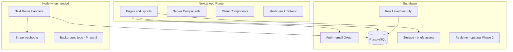
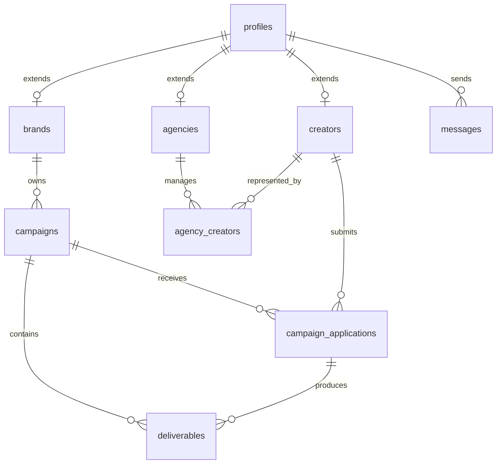

# CollabNet Influencer Marketing Platform — Implementation Plan

## Current state analysis

The repo is a **thin prototype** (~21 source files), not a production app. It validates product direction (CollabNet, four roles, dashboard shells) but has no real persistence, API surface, or component library.

| Area | What exists | Gap |
|------|-------------|-----|
| Frontend | [src/pages/Dashboard.jsx](src/pages/Dashboard.jsx) — static KPIs/tables per role | No real data, no routes beyond `/dashboard` |
| Auth | [src/context/AuthContext.jsx](src/context/AuthContext.jsx) + [backend/server.js](backend/server.js) in-memory users | No sessions, no password hashing, no RLS |
| Design | [src/index.css](src/index.css) — Inter, B/W, sidebar layout | Will be replaced by Tailwind + shadcn tokens |
| Product spec | [generate_ppt.py](generate_ppt.py) / `CollabNet_Presentation.pptx` | MERN roadmap; you chose **Supabase + Next** instead |
| Backend deps | `mongoose`, `dotenv` declared but **unused** | Remove from new architecture |

**Prototype assets to preserve (conceptually, not code):**
- Roles: `admin`, `brand`, `creator`, `agency`
- Nav structure from [src/layouts/DashboardLayout.jsx](src/layouts/DashboardLayout.jsx)
- Demo flows: login → role dashboard
- Minimal black/white aesthetic

**Your choices:** greenfield Next.js app, **JavaScript** (no TypeScript).

---

## Target architecture



**Principle:** Supabase owns auth, database, storage, and most business logic via Postgres + RLS. Node (Next Route Handlers or a small `services/` package) is used only where Supabase cannot safely hold secrets or run long tasks.

| Concern | Primary | Node (if needed) |
|---------|---------|------------------|
| Auth & sessions | Supabase Auth | — |
| CRUD & queries | Supabase client + RLS | Admin bulk ops via service role (server-only) |
| File uploads | Supabase Storage | Virus scan / resize (Phase 2) |
| Payments | Stripe + Supabase ledger tables | Webhook handler in `app/api/webhooks/stripe/route.js` |
| Social metrics | — | Proxy routes hiding API keys (Phase 2) |
| AI matching | — | Edge/API route calling OpenAI/etc. (Phase 2) |

---

## Repository layout (greenfield)

Create a new app at repo root (or `apps/web/` if you later add services). Recommended flat structure:

```
/
├── app/                          # Next.js App Router
│   ├── (auth)/login/page.jsx
│   ├── (auth)/register/page.jsx
│   ├── (dashboard)/layout.jsx    # Role-aware sidebar
│   ├── (dashboard)/page.jsx        # Overview per role
│   ├── (dashboard)/campaigns/...
│   ├── (dashboard)/creators/...
│   ├── (dashboard)/admin/...
│   └── api/webhooks/...          # Phase 2
├── components/
│   ├── ui/                       # shadcn primitives
│   └── dashboard/                # KPI cards, tables, forms
├── lib/
│   ├── supabase/client.js        # Browser client
│   ├── supabase/server.js        # Cookie-based server client
│   └── auth.js                   # getSession, requireRole
├── hooks/
├── supabase/
│   ├── migrations/               # SQL schema + RLS
│   └── seed.sql                  # Demo users (dev only)
├── public/
├── middleware.js                 # Auth gate + role redirects
├── next.config.js
├── tailwind.config.js
├── components.json               # shadcn
└── legacy-vite/                  # Optional: move current src/ here for reference
```

Archive current Vite app to `legacy-vite/` (or delete after porting login UX) so the greenfield app is the single entry point.

---

## Data model (Supabase / PostgreSQL)

Core entities mapped from prototype UI and deck:



**Tables (Phase 1):**

- `profiles` — `id` (FK `auth.users`), `role`, `name`, `avatar_url`, `created_at`
- `brands` — `profile_id`, `company_name`, `website`, `industry`
- `creators` — `profile_id`, `bio`, `niche[]`, `platforms` (jsonb), `rate_card` (jsonb)
- `agencies` — `profile_id`, `agency_name`
- `agency_creators` — `agency_id`, `creator_id`, `status`
- `campaigns` — `brand_id`, `title`, `brief`, `budget_cents`, `status` (draft|open|in_progress|completed|cancelled), `start_at`, `end_at`
- `campaign_applications` — `campaign_id`, `creator_id`, `pitch`, `proposed_rate_cents`, `status` (pending|accepted|rejected)
- `deliverables` — `application_id`, `title`, `due_at`, `status` (pending|submitted|approved|revision), `asset_url`
- `notifications` — `user_id`, `type`, `payload` (jsonb), `read_at`

**RLS highlights:**
- Brands: CRUD own `campaigns`; read applications on own campaigns
- Creators: read open campaigns; CRUD own applications & deliverables
- Agencies: read/update `agency_creators` where `agency_id` matches
- Admin: bypass via `profiles.role = 'admin'` policy or service-role server actions only

Use a Postgres `user_role` enum: `admin | brand | creator | agency`.

**Auth hook:** `on_auth_user_created` trigger → insert `profiles` row; registration flow collects role + profile fields.

---

## Auth & routing

Replace [AuthContext](src/context/AuthContext.jsx) + Express login with:

1. **Supabase Auth** — email/password (Phase 1); Google OAuth (optional Phase 1 stretch)
2. **`@supabase/ssr`** — cookie sessions in [middleware.js](middleware.js)
3. **Route groups:**
   - `(auth)` — public login/register
   - `(dashboard)` — protected; layout reads `profiles.role` and renders role nav (port from [DashboardLayout.jsx](src/layouts/DashboardLayout.jsx))
4. **Middleware rules:**
   - Unauthenticated → `/login`
   - Authenticated on `/login` → `/dashboard`
   - Role-specific paths: e.g. `/dashboard/admin/*` only for `admin`

Registration: role selection → create auth user → profile + `brands`/`creators`/`agencies` row.

---

## UI system (Tailwind + shadcn)

1. `npx create-next-app@latest` — App Router, JavaScript, Tailwind, ESLint, `src/` optional (your choice; `app/` at root is fine)
2. `npx shadcn@latest init` — **New York** or **Default** style; base color **zinc** to match current B/W ([src/index.css](src/index.css))
3. Port design tokens: black primary, muted gray text, rounded pills for buttons/badges
4. Initial shadcn components: `button`, `input`, `label`, `card`, `table`, `badge`, `dialog`, `dropdown-menu`, `tabs`, `textarea`, `select`, `avatar`, `sonner` (toasts)
5. Build shared layout: `DashboardShell` (sidebar + header + `children`) using shadcn `Sheet` for mobile

Drop remixicon or add `lucide-react` (shadcn default) for icons.

---

## When to use Node (Next Route Handlers)

| Route | Purpose | Phase |
|-------|---------|-------|
| `app/api/webhooks/stripe/route.js` | Verify signature, update `payouts` / `payments` | 2 |
| `app/api/social/[platform]/metrics/route.js` | Fetch IG/TikTok stats with server secrets | 2 |
| `app/api/match/route.js` | AI scoring creators for a campaign | 2 |
| `app/api/admin/export/route.js` | CSV export using service role | 2 |

Phase 1 should use **Server Actions** or **Route Handlers** only where the Supabase anon key is insufficient (e.g. admin user ban using service role). Prefer Supabase client + RLS for all user-scoped CRUD.

---

## Implementation sequence (recommended order)

### Sprint 0 — Foundation (week 1)
- Scaffold Next.js + Tailwind + shadcn (JS)
- Supabase project: local CLI + linked remote
- Migrations: `profiles`, enums, RLS policies, auth trigger
- `lib/supabase/client.js` + `server.js` + `middleware.js`
- Login / register / logout pages
- `DashboardShell` with role-based nav (empty states)

### Sprint 1 — Profiles & admin (week 2)
- Brand / creator / agency onboarding forms
- Creator public profile page
- Admin: user list, suspend/activate (status on `profiles`)
- Replace static admin table from prototype with real query

### Sprint 2 — Campaigns core (weeks 3–4)
- Brand: create/edit campaign (draft → open)
- Campaign list + detail pages
- Creator: browse open campaigns, apply with pitch
- Brand: review applications, accept/reject
- Status transitions enforced in DB (check constraints + RLS)

### Sprint 3 — Deliverables & storage (week 5)
- Supabase Storage buckets: `campaign-briefs`, `deliverables` (private, signed URLs)
- Deliverable checklist per accepted application
- Creator submit → brand approve/request revision
- In-app notifications on state changes

### Sprint 4 — Dashboards & polish (week 6)
- KPI cards wired to SQL aggregates (active campaigns, spend, earnings MTD)
- Agency roster: link creators, view their collabs
- Error boundaries, loading skeletons, empty states
- Seed script mirroring demo users from [backend/server.js](backend/server.js)
- Deploy: Vercel + Supabase; env: `NEXT_PUBLIC_SUPABASE_URL`, `NEXT_PUBLIC_SUPABASE_ANON_KEY`, `SUPABASE_SERVICE_ROLE_KEY` (server only)

---

## Feature list — Phase 1 (MVP)

**Goal:** End-to-end collab workflow for all four roles with real data, no payments or external APIs.

### Platform & auth
- Email/password auth (Supabase)
- Role-based registration (brand / creator / agency)
- Session persistence + protected routes
- Password reset flow

### Profiles
- Profile CRUD (avatar, name, bio)
- Brand company profile
- Creator portfolio (niche, platforms, rates)
- Agency profile

### Campaigns & workflow
- Brand: create campaign (title, brief, budget, dates, deliverable requirements)
- Campaign statuses: draft, open, in progress, completed, cancelled
- Creator: discover & filter open campaigns
- Creator: submit application (pitch, proposed rate)
- Brand: review/accept/reject applications
- Accepted collab → in progress

### Deliverables
- Per-collab deliverable list with due dates
- File upload (images/video/docs) to Supabase Storage
- Submit → brand review → approved or revision requested

### Agency
- Roster: invite/link creators to agency
- View creators’ active collabs and pipeline summary

### Admin
- Platform overview KPIs (users, active campaigns)
- User management (list, activate/deactivate)
- Campaign moderation (flag/remove if needed)

### UX & UI
- Four role dashboards with live data (port layout from prototype)
- shadcn forms, tables, dialogs
- Toast notifications for actions
- Responsive sidebar (mobile sheet)

### DevOps
- Supabase migrations in repo
- `.env.example` documented
- Vercel deployment

---

## Feature list — Phase 2 (Growth)

**Goal:** Monetization, discovery intelligence, and external integrations.

### Payments
- Stripe Connect onboarding (creators/agencies)
- Brand campaign budgets / escrow (optional)
- Automated payouts on deliverable approval
- Earnings dashboard (creator/agency) with payout history
- Invoices & platform fee

### Discovery & matching
- Advanced creator search (niche, platform, follower range, location)
- Saved lists / shortlists for brands
- AI-assisted creator–campaign matching (Node API route + embeddings or rules + LLM rank)

### Social & analytics
- OAuth connect Instagram / TikTok (where APIs allow)
- Pull follower/engagement metrics into `creators.platforms`
- Campaign performance dashboard (reach, engagement proxies)
- Export reports (PDF/CSV)

### Communication
- Real-time messaging (Supabase Realtime) per campaign thread
- Email notifications (Resend / Supabase Edge Functions)

### Agency & enterprise
- Multi-seat agency accounts (team members)
- Client portals (brands managed by agency)
- Contract templates + e-sign (DocuSign/HelloSign integration)

### Admin & compliance
- Audit log for admin actions
- Content rights / usage terms tracking
- GDPR data export/delete

### Platform quality
- Rate limiting on API routes
- Background jobs (Inngest/Trigger.dev or Supabase cron) for metrics sync
- Feature flags for gradual rollout

---

## Migration from prototype

| Prototype file | New home |
|----------------|----------|
| [Login.jsx](src/pages/Login.jsx) | `app/(auth)/login/page.jsx` + Supabase `signInWithPassword` |
| [Dashboard.jsx](src/pages/Dashboard.jsx) | Split into `app/(dashboard)/page.jsx` + role components fetching Supabase |
| [DashboardLayout.jsx](src/layouts/DashboardLayout.jsx) | `components/dashboard/DashboardShell.jsx` + shadcn sidebar |
| [index.css](src/index.css) | `app/globals.css` + Tailwind theme extension |
| [backend/server.js](backend/server.js) | **Retire** — auth via Supabase; seed via SQL |

---

## Key risks & mitigations

| Risk | Mitigation |
|------|------------|
| RLS bugs exposing data | Policy tests; use Supabase local + integration tests per role |
| Role escalation on register | Server-side role assignment only on first signup; block role changes except admin |
| Large file uploads | Storage limits, MIME allowlist, signed URLs with expiry |
| Stripe complexity | Phase 2 only; start with ledger tables in Phase 1 for “budget” without charging |

---

## Success criteria

**Phase 1 done when:** A brand can publish a campaign, a creator can apply and upload a deliverable, a brand can approve it, and each role’s dashboard reflects real counts—deployed on Vercel with Supabase RLS enforcing access.

**Phase 2 done when:** Creators receive Stripe payouts after approval, brands can search/filter creators with enriched social stats, and AI matching suggests creators for a campaign brief.
